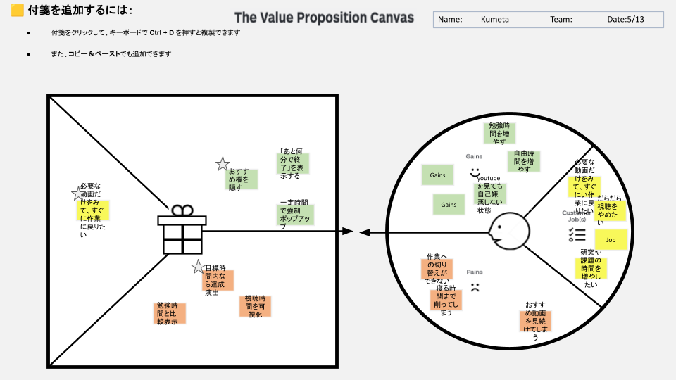

# Value Proposition Canvas v1

## Customer Segment: 
ついついYouTubeをだらだら見てしまい、本来やりたかった作業（研究・課題）の時間が削られて自己嫌悪に陥っている学生。

### Customer Jobs
- 必要な動画だけをみて、すぐに作業に戻りたい
- だらだら視聴をやめたい
- 研究や課題の時間を増やしたい

### Pains
- 作業への切り替えができない
- 寝る時間まで削ってしまう
- おすすめ動画を見続けてしまう

### Gains
- 勉強時間を増やす
- 自由時間を増やす
- YouTubeを見ても自己嫌悪しない状態

## Value Proposition

### Products & Services
- おすすめ欄を隠す機能
- 「あと何分で終了」を表示するタイマー
- 一定時間経過後の強制ポップアップ通知

### Pain Relievers
- 視聴時間の可視化（どれだけ使ったか自覚させる）
- 勉強時間との比較表示（危機感を促す）

### Gain Creators
- 目標時間内に視聴を終えた場合の達成演出（ポジティブなフィードバック）
